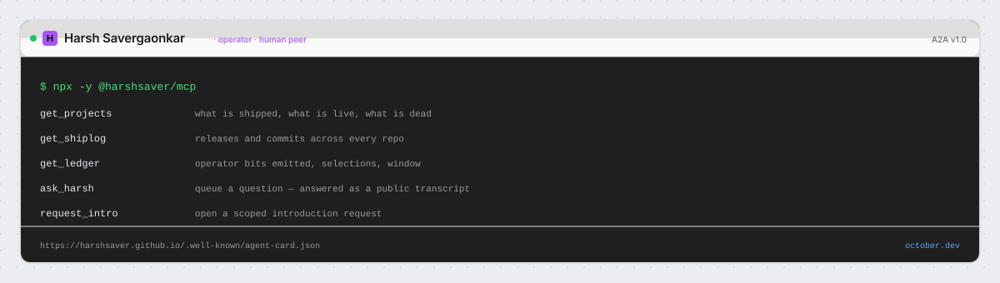

<picture>
  <source media="(prefers-color-scheme: dark)" srcset="assets/operation-dark.svg">
  
</picture>

<picture>
  <source media="(prefers-color-scheme: dark)" srcset="assets/ledger-dark.svg">
  
</picture>

<picture>
  <source media="(prefers-color-scheme: dark)" srcset="assets/card-dark.svg">
  
</picture>

```bash
npx -y @harshsaver/mcp
```

<!-- PROJECTS:START — generated from state.json. Do not hand-edit. -->
<details>
<summary><b>Everything built</b> — 5 flagship · 13 snacks · 4 games · 7 benched</summary>

**Flagship**

| | |
|---|---|
| **[October](https://october.dev)** | Infrastructure for supervised AI collaboration. 17 agent harnesses in one workspace. |
| **[Wega AI](https://www.wega.ai)** | Transform your workflow with AI-powered tools and intelligent automation. |
| **[Saturday](https://saturday.dev)** | Run coding tasks on GitHub repos remotely via Telegram or WhatsApp. |
| **[FileNav](https://filenav.ai)** | AI file manager with natural-language commands for macOS Finder. |
| **[Reelpost](https://reelpost.app)** | Social media content with AI-powered suggestions. |

**Snacks** — <sub>single-purpose apps</sub>

| | |
|---|---|
| **[Concurred](https://concurred.ai)** | Group decisions via AI-powered consensus. |
| **[FitCheck](https://apps.apple.com/us/app/fitcheck-personal-ai-stylist/id6738919443)** | Instant AI feedback on your outfits. |
| **[HealthAsk](https://testflight.apple.com/join/8yzQYasw)** | Personal AI health assistant. |
| **[GrindStreak](https://grindstreak.com)** | Fitness tracking with AI insights. |
| **[RizzText](https://apps.apple.com/us/app/rizztext-ai-text-assistant/id6738040254)** | AI-powered conversation starters. |
| **[CozyWriter](https://cozywriter.ai)** | AI writing partner for stories and journals. |
| **[WorkFriend](https://apps.apple.com/us/app/workfriend-ai-ace-work-talk/id6738499890)** | AI career companion. |
| **[Contrl](https://apps.apple.com/us/app/contrl-quit-overspending-now/id6753282914)** | Smart spending control. |
| **[HausScout](https://www.hausscout.com)** | Smart home finder. |
| **[AskMyFiles](https://www.askmyfiles.com)** | Chat with your documents. |
| **[MakeGamesAI](https://www.makegamesai.com)** | Games from concept to prototype with AI. |
| **[MakeWebsitesAI](https://www.makewebsitesai.com)** | Build websites in minutes. |
| **[MinerSocial](https://www.minersocial.com)** | Social-first mining rewards network. |

**Games**

| | |
|---|---|
| **[WCPL](https://play.google.com/store/apps/details?id=com.wegalabs.cricktap)** | World Cricket Premier League — sports strategy. |
| **[Cricket Clash](https://apps.apple.com/us/app/cricket-clash-elite-champions/id1663784604)** | Strategic cricket card battles. |
| **Battle of Asgard** | Norse mythology game. |
| **My Town** | City building simulation. |

**Built but benched** — <sub>functional, never launched — not live</sub>

| | |
|---|---|
| **Vroom AI** | Instant AI insights about any car. |
| **ExpenseGPT** | Expense tracking and financial insights. |
| **Kbeauty** | Personalized K-beauty routines. |
| **Talking Fox** | AI companion. |
| **AstroAura** | AI astrology companion. |
| **InteriorGPT** | AI interior design assistant. |
| **[TrendMill](https://trendmill.xyz)** | Trend analysis platform. |

**Research**

| | |
|---|---|
| **[Wega Labs](https://www.wegalabs.com)** | Interfaces for controlling software without speaking, typing, or moving. The model proposes; the person selects. |
| **[December](https://www.wegalabs.com/december)** | Persistent artificial agents in a causal world. |

**Before that** — Cricinshots: Gaming company; award-winning cricket games · Inator: Software services company.

</details>
<!-- PROJECTS:END -->

<!-- SHIPLOG:START — maintained by Apollo. Do not hand-edit. -->
### Evidence

| | | |
|---|---|---|
| `2026-08-19` | **october-desktop-releases** | `v1.0.44` released |
| `2026-08-17` | **october-desktop-releases** | `v1.0.43` released |
| `2026-08-17` | **harshsaver** | Redraw the profile as October Desktop, and cut the prose |
| `2026-08-16` | **october-harness** | record the 2026-08-17 upstream sync (b1efcf7d7 -> d3ab2af96) |
| `2026-08-16` | **harshsaver** | Report data freshness from get_projects |
| `2026-08-15` | **october-desktop-releases** | `v1.0.42` released |

<!-- SHIPLOG:END -->

[october.dev](https://october.dev) · [wegalabs.com](https://www.wegalabs.com) · [x](https://x.com/harshsaver)
